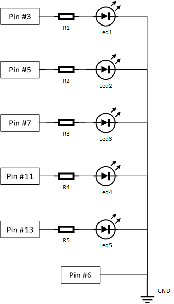

.. SoundGen documentation master file, created by
   sphinx-quickstart on Thu Oct  4 20:37:05 2018.
   You can adapt this file completely to your liking, but it should at least
   contain the root `toctree` directive.

Welcome to SoundGen's documentation!
====================================

.. toctree::
   :maxdepth: 2
   :caption: Contents:

Indices and tables
==================

* :ref:`genindex`
* :ref:`modindex`
* :ref:`search`

What is SoundGen:
=================

| SoundGen is a flexible burst mode ASK signal demodulator and frame processer, created with DVB-T in mind.
|
| This software couples an easy setup with the advantage of the flexible tuning mechanism included in the SDR kit. It includes the possibility of network integration.
| The script has been tested only for scenarios where an emitter is transmitting ASK encoded frames in bursts, spaced by periods of silence, with constant distinct RF power levels for different symbols. It is very unlikely successful demodulations will occur in any other scenario.
| This user guide is oriented towards the final user, if you are a developer who wishes to contribute please read the master thesis associated with this project. Furthermore, all the details in this document assume you have a working with a clone of the master SD card.

Example:

Demodulating a signal with a 5kHz symbol rate riding on a 95MHz carrier wave is as simple as::

 python3 SoundGen.py -f 95000000 -sym 5000

.. _here: https://github.com/Espigao25/SoundGen_Python

The code repository can be found here_ .

How to setup
--------------

1. First of all, install all the dependencies. This step is only necessary if you have not been provided with a cloned microSD card.

  - PyLab
  - RtlSdr
  - argparse
  - numpy
  - matplotlib

2. Connect the receiver/SDR kit to your RPI via USB, remember to use an adequate antenna to the carrier wave you intend to sniff.

  | Run rtl_test on the command line to check if the kit was properly detected and no warnings or errors were returned.

3. Make sure you are on the project's root folder. It should be located at ""$/SoundGen_Python/SoundGen_Python/".

|

4. You are good to go! :)

|

How to use
------------

"python3 SoundGen.py -h" on the terminal will give you a list of all the arguments you can pass into the script. They are:

+---------------+----------------------------------------------------------------------------+---------+
| Argument name | Argument description                                                       | type    |
+---------------+----------------------------------------------------------------------------+---------+
| -f *          |  Center frequency tuning, should equal the freq of your carrier wave       | int     |
+---------------+----------------------------------------------------------------------------+---------+
| -sym *        |  Symbol rate                                                               | int     |
+---------------+----------------------------------------------------------------------------+---------+
| -samp         |  Sampling rate.                                                            | int     |
+---------------+----------------------------------------------------------------------------+---------+
| -sf           |  Frame size in samples.                                                    | int     |
+---------------+----------------------------------------------------------------------------+---------+
| -nf           |  Number of frames to process before exiting (unless inf mode is enabled).  | int     |
+---------------+----------------------------------------------------------------------------+---------+
| -gain         |  Software gain, must belong to interval [0 50].                            | int     |
+---------------+----------------------------------------------------------------------------+---------+
| -i            |  Infinite mode, runs the program indefinitely if True.                     | bool    |
+---------------+----------------------------------------------------------------------------+---------+
|-db            |  Debug mode, dumps debugging info into three distinct outfiles.            | bool    |
+---------------+----------------------------------------------------------------------------+---------+
|-h             |  Ignore all other arguments, print this table and exit.                    | None    |
+---------------+----------------------------------------------------------------------------+---------+

| All arguments marked in the table with an asterisk are mandatory, the remaining are optional and will revert to default values in case no argument is supplied.

| To know the default values type into terminal ::

  python3 SoundGen.py -h

Proper format is::

  python3 SoundGen.py [arg] [value] [arg] [value] ... [arg] [value]

For example, in order to capture a signal with a 10k symbol rate on a 868MHz carrier wave, with debugging mode on and a gain of 10dB, I would type into the terminal::

  python3 SoundGen.py -f 868000000 -sym 10000 -db True -g 10

|

Demodulation
-------------

Simply providing the program with a tuning frequency and a symbol rate will always return a string of bits, even in cases when there is nothing but background noise at the specified frequency.
The output comes in two forms:

1.A real time print into the terminal instance the program is being run on.

2.A file dump of the entire signal demodulated during the total runtime of the program (see Debugging Mode for details).

|

Frame processing
------------------

Not only will this package demodulate ASK frames, it will also process them according to the following packet protocol.

| PREAMBLE + DATA + PARITY + STOP BIT

| Every time a PREAMBLE is detected and the subsequent packet passes the parity check, its DATA field will be added to a list of all the data fields successfully harvested from the current frame.

|  At the end of the program execution (or between cycles if infinite mode is turned on), all the DATA fields in that list will be dumped into a .npy file in the "./outputs/" folder. The user can run the following script in order to read the contents of the outputs folder. ::

  python3 read.npy

|  No more than 5 .npy files will ever be in that folder at any given time, if the number exceeds the limit then the oldest one will be overwritten in order to prevent memory bloating.

|  The file's name will be the timestamp of its creation.

|

Network integration
--------------------

| Currently, the easiest way to provide network integration is to remotely access the RPI (see Remote Connection) and harvest the .npy files in "./outfile" in real time.
| Measures have been taken to prevent concurrency issues. If the file is visible in the folder it means my script will no longer interact with it, ever.

|

Debugging mode
---------------

WARNING: ENABLING INFINITE MODE AND DEBUGGING MODE IN THE SAME EXECUTION IS NOT ADVISABLE.

| When the argument -db is set to 'True', the program will produce three aditional .npy files in parallel to it's normal "./outputs". These files will be placed in the script's root folder. Any debugging files from previous executions of the script still present in the destination folder will be overwritten.
| They contain the following information:

outfile_samples.npy
  A list with all the samples collected during the programs execution. This file can get very big very fast. After a few minutes of continuous execution this will become a major resource hog, it will slowdown the script considerably.

outfile_signal.npy
  A list with the demodulation result of the entire program execution. It will exclusively consist of 1's and 0's. If multiple frames were processed the results will be concatenated into a single list.

outfile_SPB.npy
  A numeric value which equals the ratio: SamplingRate/SymbolRate

Additionally, further debugging tools are available by editing three variables in the source code of the library pdata.py (lines 11-13).
| These will provide you with helpful graphs and timestamps that might help with diagnosing issues or identifying optimization routes.

|

Infinite mode
----------------

WARNING: ENABLING INFINITE MODE AND DEBUGGING MODE IN THE SAME EXECUTION IS NOT ADVISABLE.

Toggle this on if you wish for the program to run in an infinite loop

|

GPIO
-------

Some GPIO pins are configured for LED control, in order to provide the user with additional real-time feedback.

| This method works only in rigid packet mode. During normal working of the program, output signals will be produced from the RPI. These signals are intended to be used to control leds. Five different leds will be supported. Four of them [leds 1-4] will be indicative of the success rate in receiving expected packets, calculated via number of received packets versus time interval. A fifth led [led 5] will serve as a heartbeat display.

+-------------------+--------------------------------------------+
| # of active leds  |  Sucess rate interval of last iteration    |
+-------------------+--------------------------------------------+
| 0                 |  0-25%                                     |
+-------------------+--------------------------------------------+
| 1                 |  25-50%                                    |
+-------------------+--------------------------------------------+
| 2                 |  50-75%                                    |
+-------------------+--------------------------------------------+
| 3                 |  75-90%                                    |
+-------------------+--------------------------------------------+
| 4                 |  90-100%                                   |
+-------------------+--------------------------------------------+

| All resistances in the following scheme should equal 1kΩ.

|

Remote connection
---------------------

The main outputs produced by the program are printed via terminal, and therefore are fully compatible with remote SSH connections. FTP is also possible in order to access all the outfiles.
The Raspberry PI will by default create a hotspot called RPI2. The password to connect to the WiFi access point is password123.

.. _PuTTY: https://www.putty.org/
.. _FileZilla: https://filezilla-project.org/

Relevant software: PuTTY_ (SSH) and FileZilla_ (FTP)

.. _tutorial: https://www.raspberrypi.org/documentation/configuration/wireless/access-point.md

| By default the address the RPI will assign itself will be 192.168.4.1, this can be customized. Here's a good RPI wifi access point tutorial_ .

Once connected to the RPI hotspot:

.. image:: images/putty.png
  :align: center

The RPI user credentials are::

  Username: pi
  Password: raspberry

|

Autonomous mode
-----------------

On the RPI's root directory there is shell executable file configured to run on startup (startup.sh), this file can be edited to make the RPI automatically start demodulating upon power on without any necessary user input.
In order to activate this mode the user should edit the file with::

  sudo nano startup.sh

And uncomment the second line of conde, adding input arguments as necessary. (See How to use)
| When all the desired changes are done. Save and close the before rebooting the RPI with::

  sudo restart

In order to deactivate the Autonomous mode, last line of startup.sh must be commented again.
